## 驾驶证

**专项练习** https://www.jiakaobaodian.com/mnks/strengthen/car-kemu1-changsha.html

### 申请

## 判刑 p15

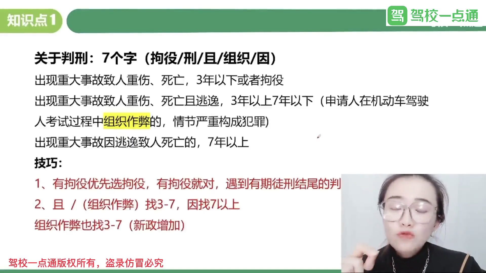

重伤，死亡 -> 拘役 或 3年以下

重伤，死亡后逃逸 -> 3~7

因逃逸致人死亡 -> 7年以上

组织作弊 -> 3~7

## 速度考点

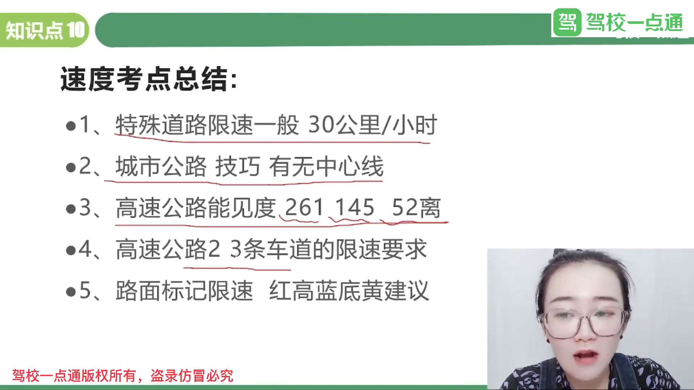

高速公路应当标明车道的行驶速度，最高车速不得超过每小时120公里，最低车速不得低于每小时60公里。

在高速公路上行驶的小型载客汽车最高车速不得超过每小时120公里，其他机动车不得超过每小时100公里，摩托车不得超过每小时80公里。

同方向有2条车道的，左侧车道的最低车速为每小时100公里。

120 ~ 100 ~ 60

同方向有3条以上车道的，最左侧车道的最低车速为每小时110公里，中间车道的最低车速为每小时90公里。

120 ~ 110 ~ 90 ~ 60

道路限速标志标明的车速与上述车道行驶车速的规定不一致的，按照道路限速标志标明的车速行驶。

## 年 考点

## 新规

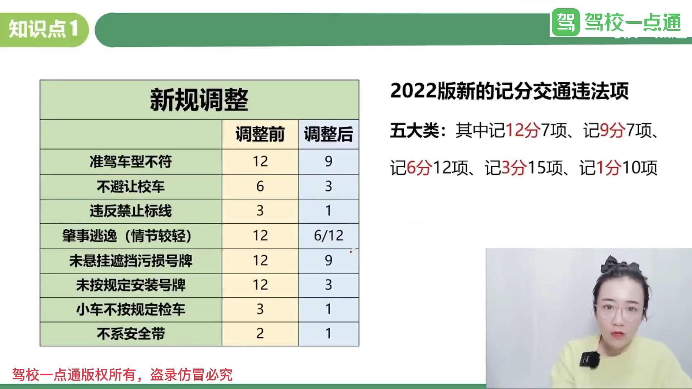

### 9种超速扣分

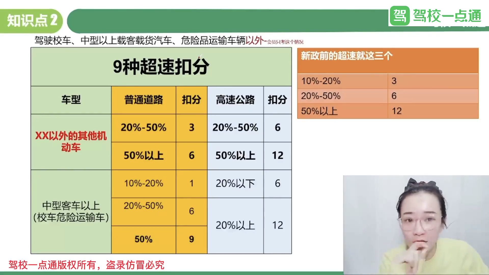

### 7种超员扣分

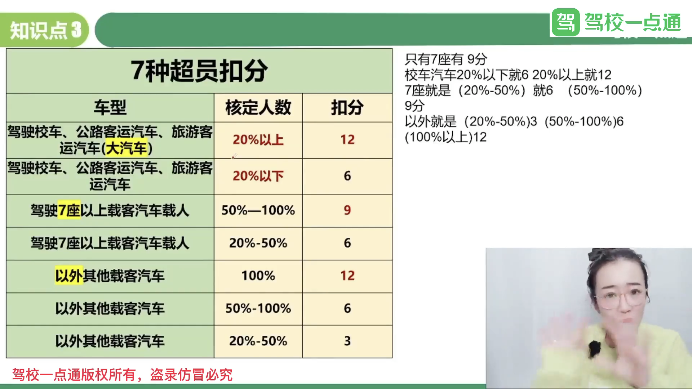

### 3种超载扣分

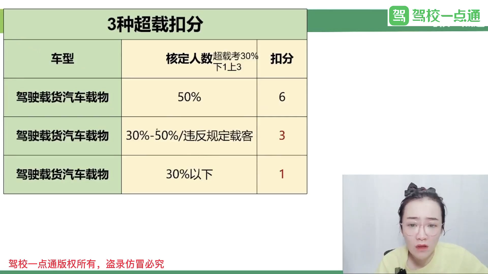

### 3种安全技术扣分

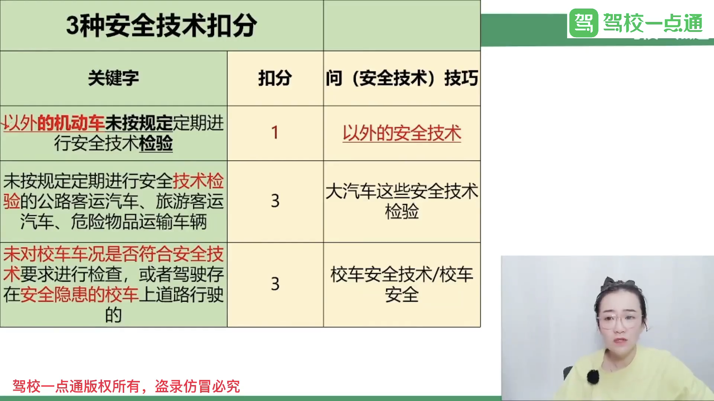	

### 扣1分的考点

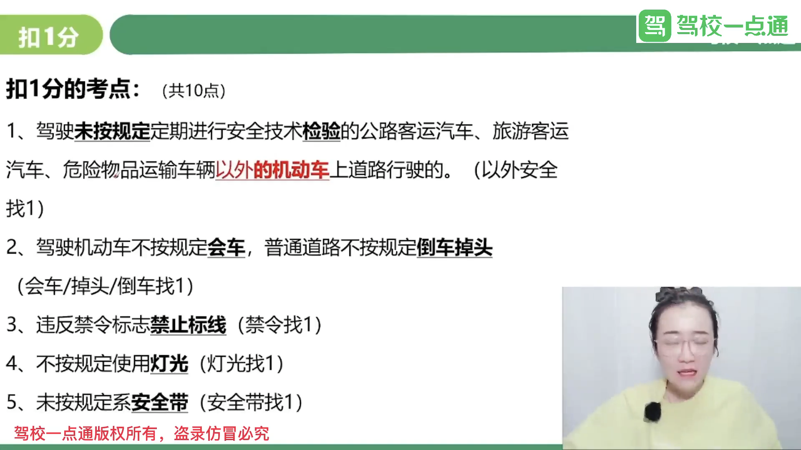

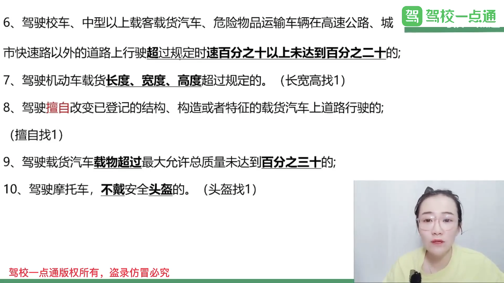

### 扣6分的考点

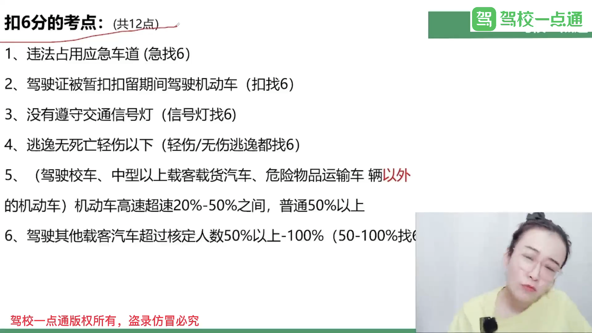

## 处理处罚题目

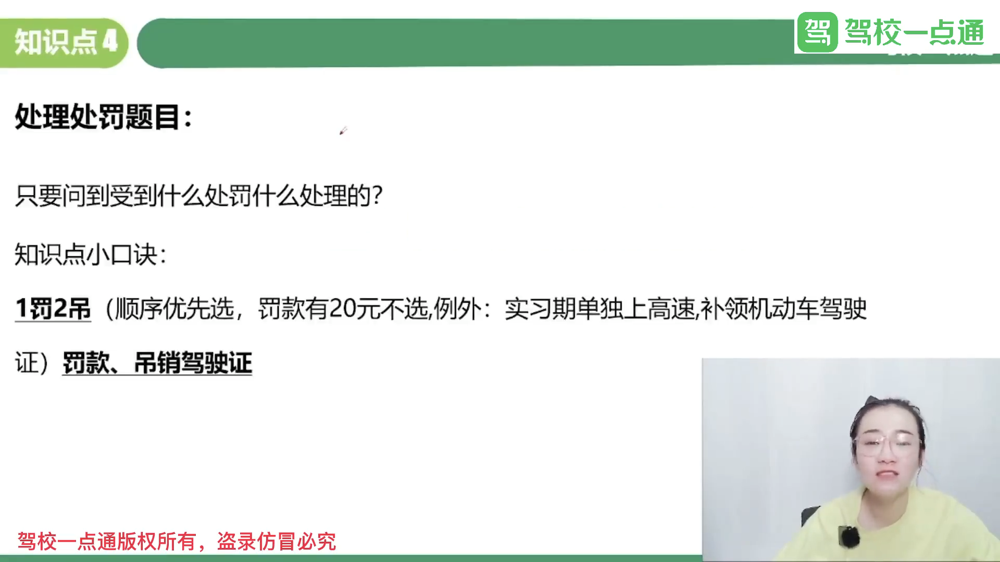

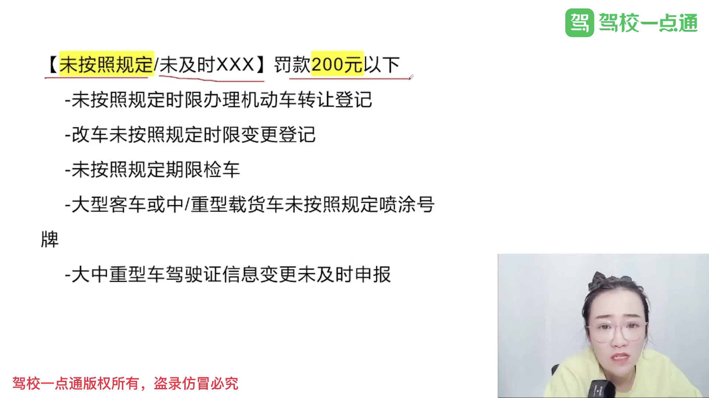

### 关于申请人假1骗3 罚款

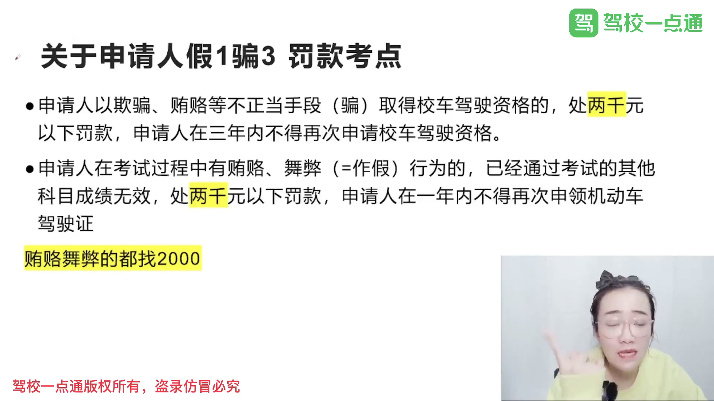

## 交警指挥姿势

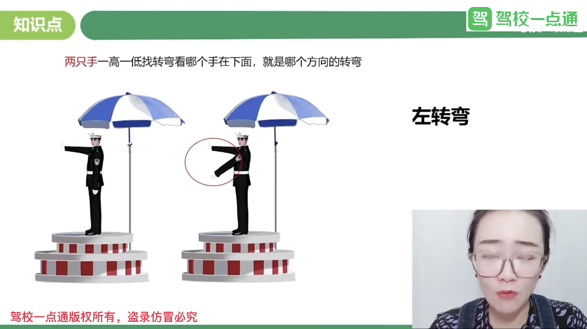

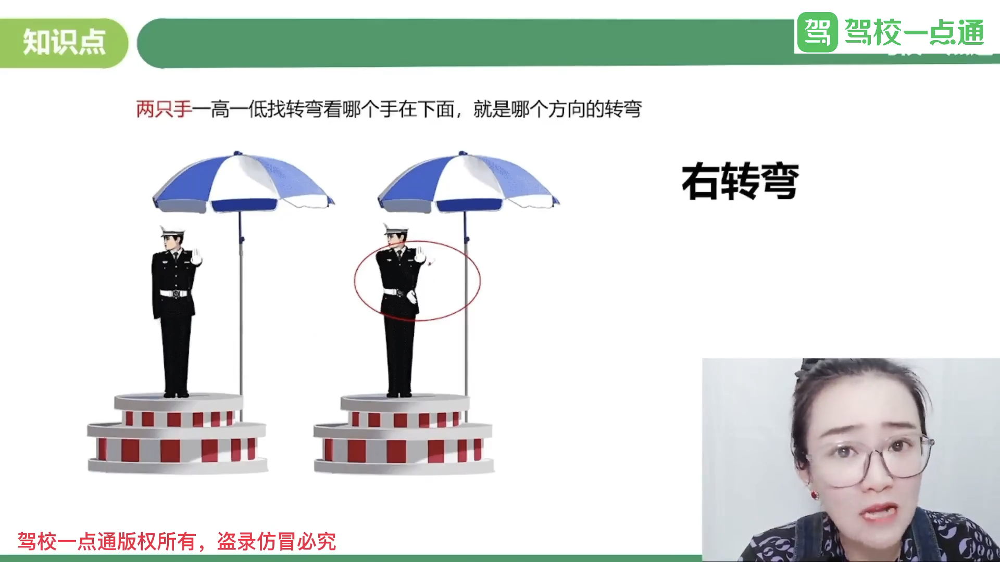

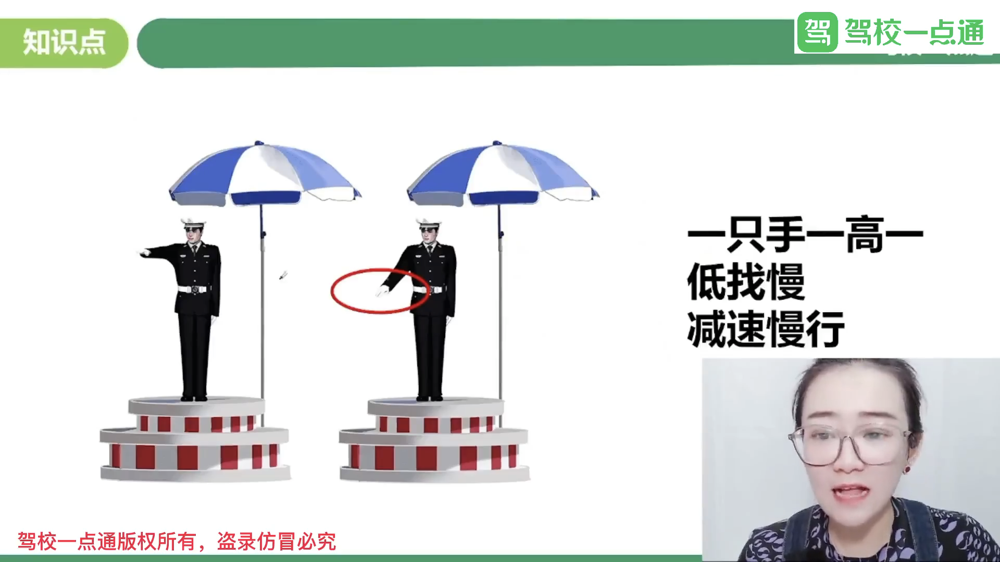

## 罚款题

### 《机动车驾驶证申领和使用规定》规定：

机动车驾驶人参加审验教育时在签注学习记录、学习过程中弄虚作假的，相应学习记录无效，重新参加审验学习，由公安机关交通管理部门处一千元以下罚款。 

代替实际机动车驾驶人参加审验教育的，由公安机关交通管理部门处二千元以下罚款。 

组织他人实施前两款行为之一，有违法所得的，由公安机关交通管理部门处违法所得三倍以下罚款，但最高不超过二万元；

没有违法所得的，由公安机关交通管理部门处二万元以下罚款。

《道路交通安全违法行为记分管理办法》规定：

机动车驾驶人参加**满分教育**时在签注学习记录、满分学习考试中弄虚作假的，相应学习记录、考试成绩无效，由公安机关交通管理部门处一千元以下罚款。

机动车驾驶人在参加接受交通安全教育扣减交通违法行为记分中弄虚作假的，由公安机关交通管理部门撤销相应记分扣减记录，恢复相应记分，处一千元以下罚款。

代替实际机动车驾驶人参加满分教育签注学习记录、满分学习考试或者接受交通安全教育扣减交通违法行为记分的，由公安机关交通管理部门处二千元以下罚款。

组织他人实施前三款行为之一，有违法所得的，由公安机关交通管理部门处违法所得三倍以下罚款，但最高不超过二万元；没有违法所得的，由公安机关交通管理部门处二万元以下罚款。

| 作假 | 1000元      |      |
| ---- | ----------- | ---- |
| 代替 | 2000元      |      |
| 组织 | 3倍以下~2万 |      |
|      |             |      |

-----

《机动车登记规定》规定：已注册登记的机动车所有权发生转让的，现机动车所有人应当自机动车交付之日起三十日内向登记地车辆管理所申请转让登记。现机动车所有人未按规定的时限办理转让登记的，由公安机关交通管理部门处警告或者二百元以下罚款。

### 道路交通安全违法行为记分管理办法》规定，

申请人**隐瞒**有关情况或者提供**虚假**材料申领机动车或校车驾驶证的，公安机关交通管理部门不予受理或者不予办理，处**五百元**以下罚款；申请人在**一年**内不得再次申领机动车或校车驾驶证。

申请人在**考试**过程中有**贿赂、舞弊**行为的，取消考试资格，已经通过考试的其他科目成绩无效，公安机关交通管理部门处**二千元**以下罚款；申请人在**一年内**不得再次申领机动车驾驶证。

申请人以欺骗、贿赂等不正当手段**取得机动车或校车驾驶证**的，公安机关交通管理部门收缴机动车驾驶证，撤销机动车驾驶许可，处二千元以下罚款；申请人在**三年**内不得再次申领机动车或校车驾驶证。

组织、参与实施前三款行为之一牟取**经济利益**的，由公安机关交通管理部门处违法所得三倍以上五倍以下罚款，但最高不超过十万元。

| 提交材料来申领, 考试前 | 500, 一年          |      |
| ---------------------- | ------------------ | ---- |
| 考试作假， 考试中      | 2000,一年          |      |
| 作假取得驾驶证，考试完 | 2000，三年         |      |
| 组织，经济利益         | 3～5倍，不超过十万 |      |

-----

### 机动车登记规定》规定，有下列情形之一的，由公安机关交通管理部门处警告或者二百元以下罚款：

（一）重型、中型载货汽车、专项作业车、挂车及大型客车的车身或者车厢后部未按照规定喷涂放大的牌号或者放大的牌号不清晰的；（二）机动车喷涂、粘贴标识或者车身广告，影响安全驾驶的；

（三）载货汽车、专项作业车及挂车未按照规定安装侧面及后下部防护装置、粘贴车身反光标识的；

（四）机动车未按照规定期限进行安全技术检验的；

（五）改变车身颜色、更换发动机、车身或者车架，未按照第十六条规定的时限办理变更登记的；

（六）机动车所有权转让后，现机动车所有人未按照第二十五条规定的时限办理转让登记的；

（七）机动车所有人办理变更登记、转让登记，未按照第十八条、第二十七条规定的时限到住所地车辆管理所申请机动车转入的；

（八）机动车所有人未按照第二十三条规定申请变更备案的。

饮酒后驾驶机动车的，处暂扣六个月机动车驾驶证，并处一千元以上二千元以下罚款。

因饮酒后驾驶机动车被处罚，再次饮酒后驾驶机动车的，处十日以下拘留，并处一千元以上二千元以下罚款，吊销机动车驾驶证。

造成交通事故后逃逸，尚不构成犯罪的由公安机关交通管理部门处二百元以上二千元以下罚款，可以并处15日以下拘留。

将机动车交由未取得机动车驾驶证的人驾驶的，由公安交通管理部门处二百元以上二千元以下罚款，并处以吊销驾驶证的处罚。

伪造、变造或者使用伪造、变造的机动车登记证书、号牌、行驶证、驾驶证的，由公安机关交通管理部门予以收缴，

扣留该机动车，处十五日以下拘留，并处二千元以上五千元以下罚款；构成犯罪的，依法追究刑事责任。

饮酒1千元,  

### 一次记1分

（一）驾驶校车、中型以上载客载货汽车、危险物品运输车辆在高速公路、城市快速路**以外**的道路上行驶超过规定时速百分之十以上未达到百分之二十的；

（二）驾驶机动车不按规定会车，或者在普通道路上不按规定倒车、掉头的；

（三）驾驶机动车不按规定使用灯光的；

（四）驾驶机动车违反禁令标志、禁止标线指示的；

（五）驾驶机动车载货长度、宽度、高度超过规定的；

（六）驾驶载货汽车载物超过最大允许总质量未达到百分之三十的；

（七）驾驶未按规定定期进行安全技术检验的公路客运汽车、旅游客运汽车、危险物品运输车辆以外的机动车上道路行驶的；

（八）驾驶擅自改变已登记的结构、构造或者特征的载货汽车上道路行驶的；

（九）驾驶机动车在道路上行驶时，机动车驾驶人未按规定系安全带的；

（十）驾驶摩托车，不戴安全头盔的。

### 一次记**3**分

（一）驾驶校车、公路客运汽车、旅游客运汽车、7座以上载客汽车以外的其他载客汽车载人超过核定人数百分之二十以上未达到百分之五十的；

（二）驾驶校车、中型以上载客载货汽车、危险物品运输车辆以外的机动车在高速公路、城市快速路以外的道路上行驶超过规定时速百分之二十以上未达到百分之五十的；

（三）驾驶机动车在高速公路或者城市快速路上不按规定车道行驶的；

（四）驾驶机动车不按规定超车、让行，或者在高速公路、城市快速路以外的道路上逆行的；

（五）驾驶机动车遇前方机动车停车排队或者缓慢行驶时，借道超车或者占用对面车道、穿插等候车辆的；

（六）驾驶机动车有拨打、接听手持电话等妨碍安全驾驶的行为的；

（七）驾驶机动车行经人行横道不按规定减速、停车、避让行人的；

（八）驾驶机动车不按规定避让校车的；

（九）驾驶载货汽车载物超过最大允许总质量百分之三十以上未达到百分之五十的，或者违反规定载客的；

（十）驾驶不按规定安装机动车号牌的机动车上道路行驶的；

（十一）在道路上车辆发生故障、事故停车后，不按规定使用灯光或者设置警告标志的；

（十二）驾驶未按规定定期进行安全技术检验的公路客运汽车、旅游客运汽车、危险物品运输车辆上道路行驶的；

（十三）驾驶校车上道路行驶前，未对校车车况是否符合安全技术要求进行检查，或者驾驶存在安全隐患的校车上道路行驶的；

（十四）连续驾驶载货汽车超过4小时未停车休息或者停车休息时间少于20分钟的；

（十五）驾驶机动车在高速公路上行驶低于规定最低时速的。*

### 一次记**6**分

（一）驾驶校车、公路客运汽车、旅游客运汽车载人超过核定人数未达到百分之二十，或者驾驶7座以上载客汽车载人超过核定人数百分之二十以上未达到百分之五十，或者驾驶其他载客汽车载人超过核定人数百分之五十以上未达到百分之百的；

（二）驾驶校车、中型以上载客载货汽车、危险物品运输车辆在高速公路、城市快速路上行驶超过规定时速未达到百分之二十，或者在高速公路、城市快速路以外的道路上行驶超过规定时速百分之二十以上未达到百分之五十的；

（三）驾驶校车、中型以上载客载货汽车、危险物品运输车辆以外的机动车在高速公路、城市快速路上行驶超过规定时速百分之二十以上未达到百分之五十，或者在高速公路、城市快速路以外的道路上行驶超过规定时速百分之五十以上的；

（四）驾驶载货汽车载物超过最大允许总质量百分之五十以上的；

（五）驾驶机动车载运爆炸物品、易燃易爆化学物品以及剧毒、放射性等危险物品，未按指定的时间、路线、速度行驶或者未悬挂警示标志并采取必要的安全措施的；

（六）驾驶机动车运载超限的不可解体的物品，未按指定的时间、路线、速度行驶或者未悬挂警示标志的；

（七）驾驶机动车运输危险化学品，未经批准进入危险化学品运输车辆限制通行的区域的；

（八）驾驶机动车不按交通信号灯指示通行的；

（九）机动车驾驶证被暂扣或者扣留期间驾驶机动车的；

（十）造成致人轻微伤或者财产损失的交通事故后逃逸，尚不构成犯罪的；

（十一）驾驶机动车在高速公路或者城市快速路上违法占用应急车道行驶的。

### 一次记9分

（一）驾驶7座以上载客汽车载人超过核定人数百分之五十以上未达到百分之百的；

（二）驾驶校车、中型以上载客载货汽车、危险物品运输车辆在高速公路、城市快速路以外的道路上行驶超过规定时速百分之五十以上的；

（三）驾驶机动车在高速公路或者城市快速路上违法停车的；*

（四）驾驶未悬挂机动车号牌或者故意遮挡、污损机动车号牌的机动车上道路行驶的；

（五）驾驶与准驾车型不符的机动车的；

（六）未取得校车驾驶资格驾驶校车的；

（七）连续驾驶中型以上载客汽车、危险物品运输车辆超过4小时未停车休息或者停车休息时间少于20分钟的。

### 一次记**12**分

（一）**饮酒**后驾驶机动车的；

（二）造成致人轻伤以上或者死亡的交通事故后**逃逸**，尚不构成犯罪的；

（三）使用**伪造、变造**的机动车号牌、行驶证、驾驶证、校车标牌或者使用其他机动车号牌、行驶证的；

（四）驾驶校车、公路客运汽车、旅游客运汽车载人超过核定人数百分之二十以上，或者驾驶其他载客汽车载人超过核定人数百分之百以上的；

（五）驾驶校车、中型以上载客载货汽车、危险物品运输车辆在高速公路、城市快速路上行驶超过规定时速百分之二十以上，或者驾驶其他机动车在高速公路、城市快速路上行驶超过规定时速百分之五十以上的；

（六）驾驶机动车在高速公路、城市快速路上倒车、逆行、穿越中央分隔带掉头的；*

（七）代替实际机动车驾驶人接受交通违法行为处罚和记分牟取经济利益的。

### 超速罚款

机动车行驶超过规定时速50%的，由公安交通管理部门处二百元以上二千元以下罚款，可以并处吊销机动车驾驶证。

